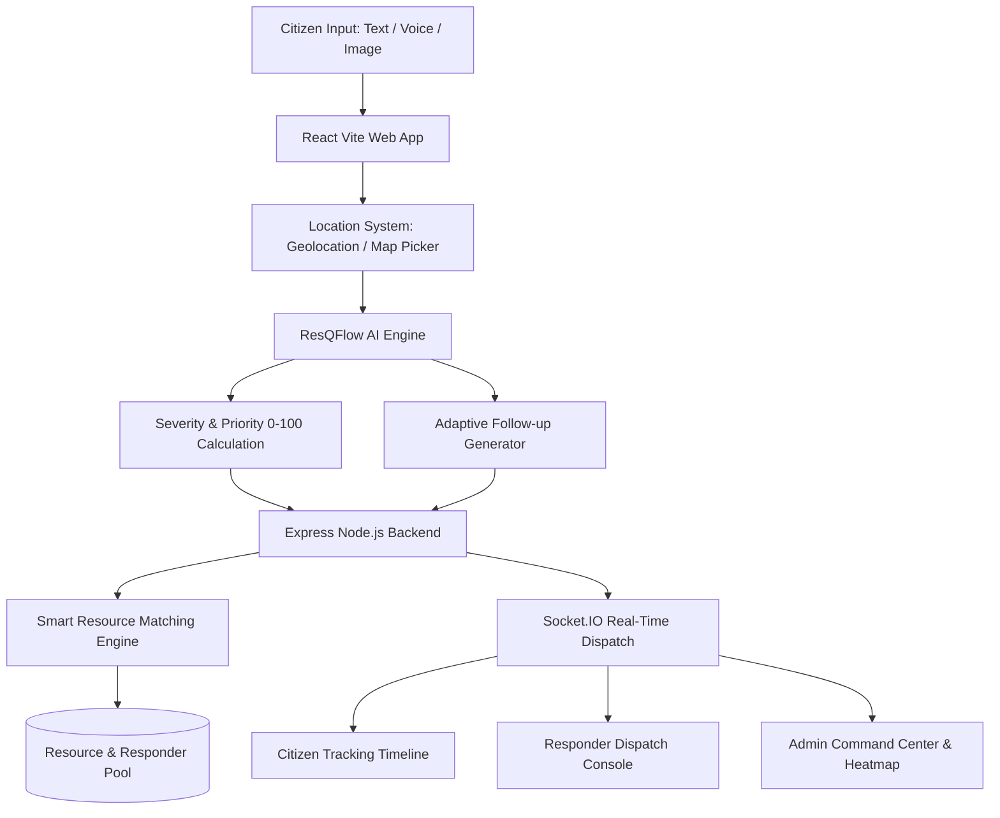

# ResQFlow — AI-Powered Emergency Coordination & Response Platform

> *"From Emergency Report to Coordinated Response."*

ResQFlow is an end-to-end, AI-powered emergency coordination platform designed to eliminate dispatch delays, extract critical situation intelligence from multi-modal inputs (text, voice, image), calculate objective triage priority scores (0–100), and optimize responder resource allocation in real time.

---

## 🚀 Core Features

- **Multi-Modal Emergency Reporting**:
  - **Text Reporting**: Natural language input with automatic entity extraction.
  - **Voice Emergency Reporting**: Hands-free speech-to-text integration via Web Speech API with fallback transcription editor.
  - **Image Scene Analysis**: Automated computer vision analysis identifying visible hazards, vehicle damage, and estimated severity.
  - **Location Intelligence**: Browser GPS auto-locate, address landmark input, and interactive Leaflet map pin-picker.

- **AI Triage & Priority Engine**:
  - Categorizes emergencies (Road Accident, Medical Emergency, Fire, Crime, Natural Disaster, Missing Person, Building Collapse).
  - Calculates 0–100 **AI Priority Score** (CRITICAL, HIGH, MEDIUM, LOW) based on symptoms, trapped victims, unconsciousness, and hazardous environments.
  - Generates **Adaptive Follow-Up Questions** customized per emergency category.

- **Smart Resource Matching**:
  - Recommends nearest available Hospitals, Ambulances, Police Stations, and Fire Engines using Haversine proximity, capacity, and workload scoring.

- **Real-Time Responder & Admin Dispatch Console**:
  - **Citizen Tracking**: Live stage-by-stage status timeline (`REPORTED` ➔ `VERIFIED` ➔ `ASSIGNED` ➔ `ACCEPTED` ➔ `EN ROUTE` ➔ `ON SCENE` ➔ `RESOLVED`).
  - **Responder Console**: Interactive dispatch map with color-coded priority pins, action controls, and field dispatch notes.
  - **Admin Command Center**: Operations metrics, incident search/filters/sorting, responder assignment, density heatmap, and Recharts analytics.

- **Hackathon Demo Mode**:
  - Top sticky bar for instant 1-click role switching between **Citizen**, **Responder**, and **Admin Ops**, plus demo dataset reset button.

---

## 🛠️ Technology Stack

- **Frontend**: React 18, Vite, Tailwind CSS, Lucide Icons, Leaflet & React-Leaflet, Recharts, Socket.IO Client.
- **Backend**: Node.js, Express, Socket.IO, JWT Auth, Bcrypt.js, CORS, Dotenv.
- **Database**: Express JSON DB Store with full MongoDB Mongoose schema compatibility.
- **AI Service Pipeline**: Multi-modal NLP & Vision extraction engine with intelligent rule fallback.

---

## 📐 Architecture Diagram



---

## ⚡ Quick Start & Setup Instructions

### 1. Clone & Install Dependencies

```bash
# Navigate to workspace
cd resqflow

# Install server dependencies
cd server
npm install

# Install client dependencies
cd ../client
npm install
```

### 2. Environment Variables Setup

Create a `.env` file in `server/` (or refer to `.env.example`):

```env
PORT=5000
JWT_SECRET=resqflow_super_secret_hackathon_key_2026
```

### 3. Run the Server & Client

In terminal 1 (Server):
```bash
cd server
npm start
```

In terminal 2 (Client):
```bash
cd client
npm run dev
```

Open [http://localhost:3000](http://localhost:3000) in your browser.

---

## 🔑 Demo Credentials

| Role | Email | Password | Quick Switch |
| :--- | :--- | :--- | :--- |
| **Citizen** | `citizen@resqflow.org` | `password123` | Click **Citizen** in Top Demo Bar |
| **Responder** | `responder@resqflow.org` | `password123` | Click **Responder** in Top Demo Bar |
| **Admin** | `admin@resqflow.org` | `password123` | Click **Admin Ops** in Top Demo Bar |

---

## 📖 API Documentation

### Auth APIs
- `POST /api/auth/register`: Register user account
- `POST /api/auth/login`: Authenticate user & receive JWT token
- `GET /api/auth/me`: Get current user details

### Incident APIs
- `POST /api/incidents`: Submit new emergency report
- `GET /api/incidents`: Fetch incidents list (with optional query filters)
- `GET /api/incidents/:id`: Fetch single incident details & timeline history
- `PUT /api/incidents/:id/status`: Update status (`ACCEPTED`, `EN ROUTE`, `ON SCENE`, `RESOLVED`)
- `POST /api/incidents/:id/assign`: Assign responder squad
- `DELETE /api/incidents/:id`: Cancel accidental emergency report
- `GET /api/incidents/reset-demo`: Reset dataset to default hackathon state

### Resource & Responder APIs
- `GET /api/resources/nearby`: Get recommended nearby hospitals, ambulances & fire stations
- `GET /api/responders/nearby`: Get nearby active response units
- `GET /api/analytics`: Fetch command center metrics, heatmap density points, and chart datasets

---

## 🔮 Future Scope

1. **IoT Sensor & Telematics Integration**: Auto-trigger emergency reports upon vehicle airbag deployment or crash sensors.
2. **Smart City CCTV Integration**: Automated computer vision hazard detection from traffic cameras.
3. **Government & Public Safety API Integrations**: Direct integration with 911 / 112 emergency dispatch systems.
4. **Predictive Incident Hotspots**: Machine learning models predicting high-risk emergency zones based on weather and traffic density.
5. **Multilingual Emergency Reporting**: Real-time voice translation for non-native speakers.
