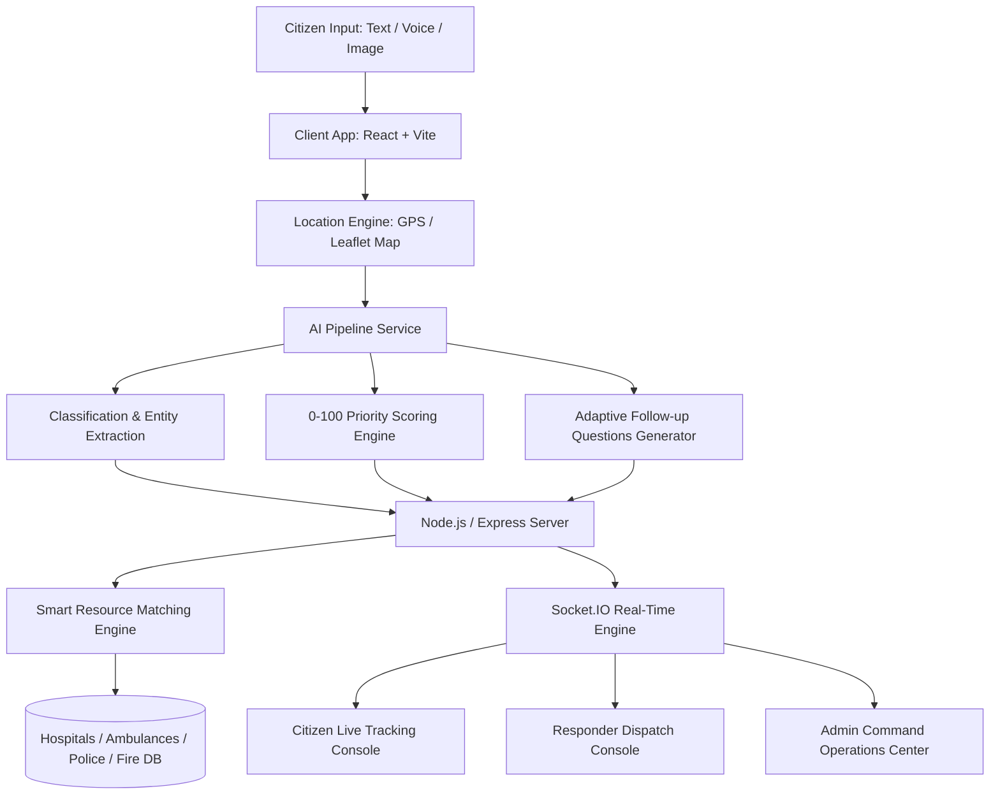

# ResQFlow Architecture & Technical Blueprint

ResQFlow is designed as an end-to-end emergency intelligence platform combining multi-modal report processing, priority triage scoring, smart resource matching, and real-time WebSocket dispatch.

## System Components

1. **Frontend Layer (React 18 + Vite + Tailwind CSS)**:
   - Modern emergency command theme with dark glassmorphism aesthetic.
   - Interactive Leaflet maps (`InteractiveMap`) supporting pin location pickers and color-coded priority markers.
   - Browser Web Speech API speech-to-text integration with manual fallback.
   - Recharts command center analytics module.

2. **AI Processing Pipeline (`server/src/services/aiEngine.js`)**:
   - Classifies incident types (Road Accident, Medical Emergency, Fire, Natural Disaster, Crime, Missing Person, Building Collapse).
   - Computes deterministic Priority Score (0–100) based on unconsciousness, severe trauma, active fire, trapped individuals, and victim counts.
   - Generates adaptive follow-up questions tailored to emergency category.

3. **Smart Resource Matching Algorithm (`server/src/services/matchEngine.js`)**:
   - Calculates distance (Haversine formula in KM) and match score:
     $$\text{Match Score} = f(\text{Distance}, \text{Resource Type}, \text{Availability}, \text{Workload})$$
   - Matches nearby Hospitals, Ambulances, Police Stations, and Fire Squads.

4. **Real-Time Communication (`server/src/services/socketService.js`)**:
   - Socket.IO WebSockets emit instant updates on incident creation, status changes (`REPORTED` -> `VERIFIED` -> `ASSIGNED` -> `ACCEPTED` -> `EN ROUTE` -> `ON SCENE` -> `RESOLVED`), and push notifications.
